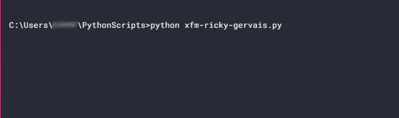

<div align="center">


# xfm-ricky-gervais

   

</div>


## Overview
Downloads all four seasons of the [XFM Ricky Gervais Show](https://www.therickygervaisshow.com/xfm-vault) in MP4 format, and saves each season in named folders within the user's Downloads folder. Written in Python for Windows.


## :memo: Usage

```
python xfm-ricky-gervais.py
```



## :snake: Dependencies

### Packages
* Selenium (with geckodriver)

### Libraries
* pytube

### Modules
* pathlib
* os

## ⚖️ License

[](https://github.com/presentformyfriends/xfm-ricky-gervais/blob/master/LICENSE)

